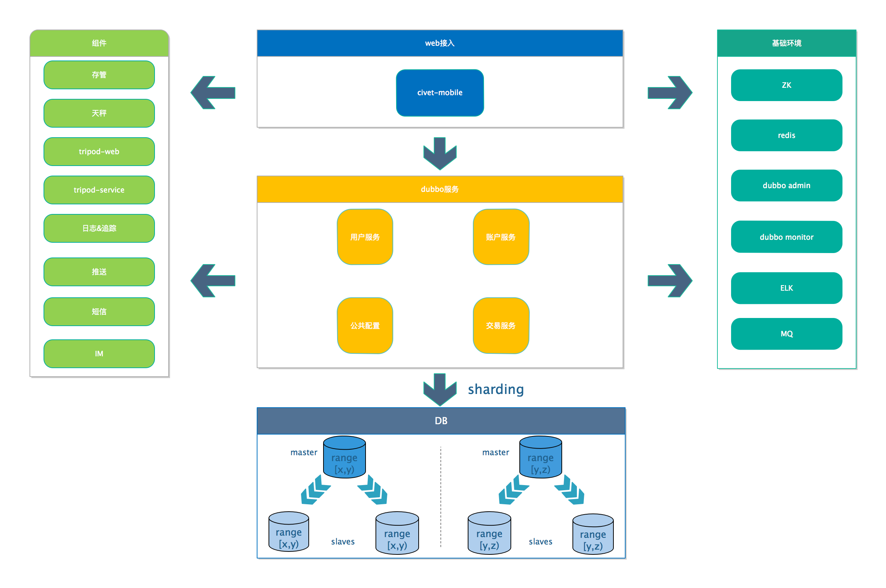
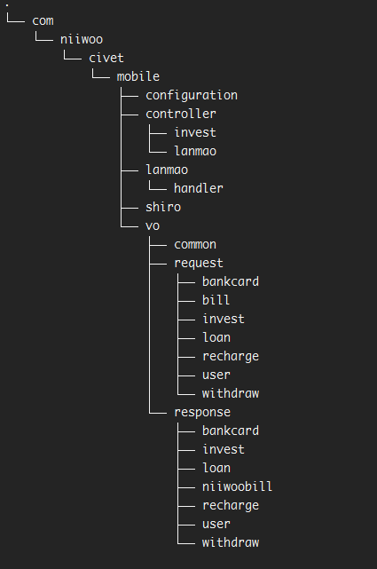
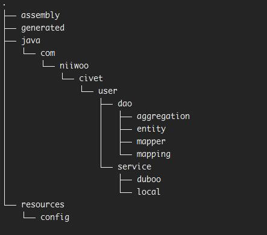
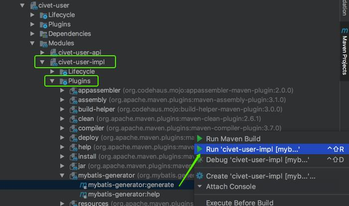
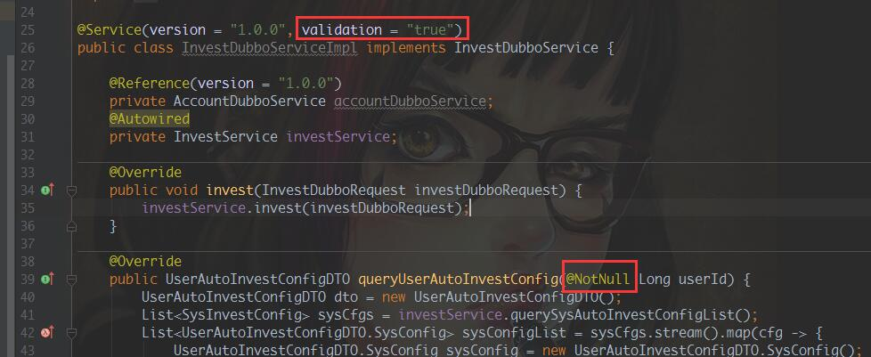
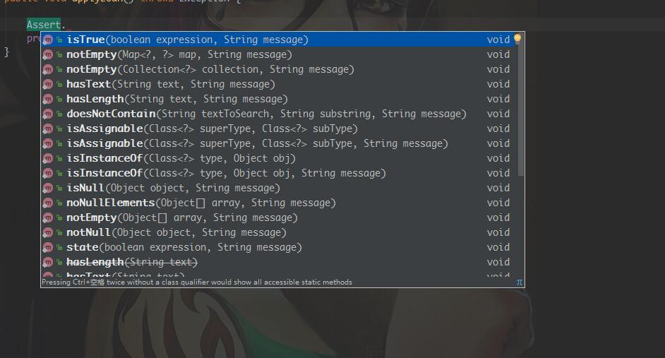

= 架构组开发规范&约定

== 目的

==== 1、统一标准、统一风格

== 工程整体结构

==== 项目结构主要由三大部分构成：基础组件、基础环境、业务开发项目。
===== 基础组件gitlab仓库地址：http://192.168.18.14:81/platform-architecture/tripod.git

* 1、基础组件包含了第三方服务调用以及支持业务快速开发的web层基础库，service层基础库等。业务开发项目直接maven依赖这些组件库Autowired注入相关类即可使用相关功能。
* 2、基础环境为业务项目依赖软件环境，使用到的技术栈。
* 3、web接入层、dubbo服务层、DB属于业务开发需要关心的模块，以下针对这些模块做详细说明
* 4、	整个组件库与业务开发项目主要使用spring-boot技术栈。[red]`不使用传统xml配置bean，使用java config方式配置spring bean。可变配置项集中到application.yml中配置，方便开发运维的维护管理。`

== web接入层
* 1、职责：定义HTTP请求接口，请求报文，响应报文，做请求必填项与安全性校验，调用内部服务，聚合组装服务结果响应给客户端。
* 2、包结构：
以civet-mobile为例，com.civet.mobile为该模块顶级目录，其下按职能分不同子包。如controller、vo等。各个职能包下可按业务功能不同再分子包，如controller.invest、controller.user等。方便做切面配置时基于职能织入切面。[red]`web层的与前端交互的数据模型称之为vo(view object)，放置在vo包下。`

* 3、基础类：为统一规范公共数据模型，在tripod-web中定义了部分客户端请求响应公共数据模型
[source,java,indent=0]
com.tripod.web.vo.Empty：仅返回respCode，message。无业务数据，一般用户增删改请求时。
com.tripod.web.vo.Result<T>：带有业务数据返回的统一数据模型，泛型T为具体业务数据。
com.tripod.web.vo.Page<T>：分页响应数据模型，规范统一分页数据。
T为分页明细中具体业务数据模型。
com.tripod.web.vo.PageRequestVO：分页请求数据模型，统一pageNumber，pageSize参数，具体业务场景按需继承该类，填充分页查询其他参数。
* 4、认证、授权: 项目使用shiro做认证授权处理，通用逻辑集成在tripod-web组件中，业务项目依赖该组件并实现com.tripod.web.shiro.UserDetailService接口查询用户身份，权限信息即可。controller中定义的接口默认需要认证(登录)后才能访问，如需未认证访问，在controller类或者方法上加@AuthIgnore来忽略认证。认证后的访问业务代码可以获取到shiro中维护的用户身份信息
[source,java]
获取认证后当前用户id:
Long userId = PrincipalContext.getUserId();
获取认证后当前用户sessionId:
String sessionId = PrincipalContext.getSessionId();

== 服务层
* 1、职责：提供分布式服务，接受处理服务消费者的请求，访问存储层查询、持久化业务数据。
* 2、模块结构：
以civet-user服务为例，分为civet-user-api和civet-user-impl两个maven module。
api定义了服务规范：请求、响应数据模型，服务接口、异常、常量等。是服务消费者与提供者的契约。服务消费者仅依赖服务提供者api模块。[red]`服务间的请求/响应数据模型称之为dto(data transfer object)，放置在dto包下。`

impl定义服务具体实现：如何处理消费者的请求，操作具体业务逻辑。或调用其他服务。
包结构依然遵循按职能分包，request、response、service、exception等
职能下可按业务功能再分子包。

impl是服务具体实现模块，其中包含数据存储的访问。
com.civet.user为模块顶级目录，其下主要包含service包（具体业务逻辑处理），dao包（数据存储访问处理）。
[red]`service.dubbo： api模块中dubbo接口的具体实现，接受服务消费者请求，或请求其他dubbo服务，相当于服务内通讯层。`
[red]`service.local：服务内部具体实现，本地事物应该该层处理，本地事物不应出现在dubbo服务通讯层。`
dao包下主要包含entity（与数据库对应的数据模型），mapper（mybatis接口），mapping（mybatis的sql xml）。
dao包下内容每个模块执行mybatis-generator插件自动生成：

自动生成的配置文件位于每个impl模块src/main/generated/ generator.xml。生成内容放在src/main/generated目录下，按需拷贝覆盖到com.civet.user.dao目录下。
MapperExt.java：业务扩展mybatis的Mapper接口，自动生成的与业务添加的隔离
MapperExt.xml：业务扩展sql xml文件。
mybatis-generator生成的entity、mapper接口、xml 统一不加表名前缀，如表名t_tc_project 生成entity为Project.java，mapper为ProjectMapper.java，xml为ProjectMapper.xml。

* 3、服务间基础数据模型：

[source,java]
com.tripod.provider.dto.request.PageRequestDTO:服务间分页请求数据模型，统一定义了pageNumber第几页，pageSize页大小。业务数据模型有额外参数请继承该类，添加额外属性。

[source,java]
com.tripod.provider.dto.request.PageRequestDTO#getOffset()计算sql的limit偏移值。mybatis使用ognl取值，limit #{offset}, 10 会调用getOffset()方法

[source,java]
com.tripod.provider.dto.response.PageResponseDTO<T>:服务间分页响应数据模型，统一定义了totalCount、totalPage、items。

[source,java]
com.tripod.provider.dto.response.PageResponseDTO#measureTotalPage(int totalCount, int pageSize)计算totalPage

== 异常处理

==== 整个系统内异常主要分系统异常、业务异常两大类。
* 1、业务异常：com.tripod.base.exception.BizException及其子类，业务异常应由业务处理过程中判定不满足业务条件时开发人员手动显示抛出，调用throw new BizException(String errorCode, String... errorMessage)方法。或者throw new BizException(String errorCode, String errorMessage)。
其中errorCode为统一维护的业务异常码，由每个业务服务api提供(resources/messsage/xxx.message.xml中定义的KV键值对)，errorMessage为可变参数，提供额外说明。

* 2、系统异常：除业务异常以外统一捕获到的异常都作系统异常处理，返回给客户端系统错误。

* 3、[red]`服务间调用服务提供方需要在dubbo service这道大门做必要参数校验。`

** 3.1、入参为原始/包装类型：

** 3.2、入参为自定义对象类型：请在对象属性上加上JSR303校验注解。

** 3.3、使用org.springframework.util.Assert类手动校验
各个参数。

==== [red]`输入参数不满足规则给出的错误或异常不应该是BizException，它不属于业务异常。而是调用者没有满足调用规范，是系统问题。` org.springframework.util.Assert类判断不通过会抛出java.lang.IllegalStateException异常。

== 日期时间处理

* 1、日期时间运算：Jodatime
* 2、日期时间格式化：FastDateFormat
