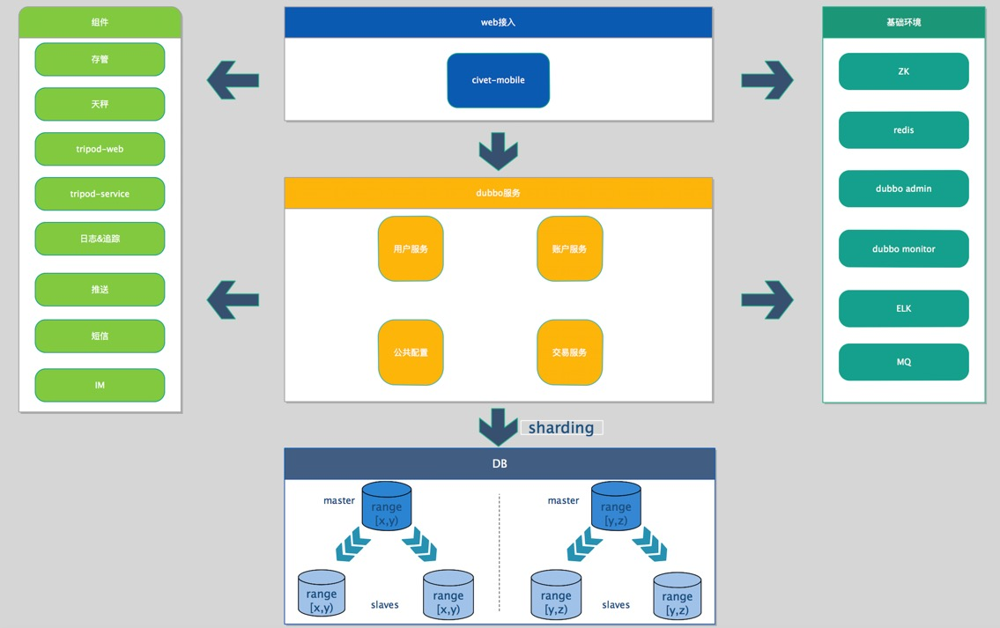
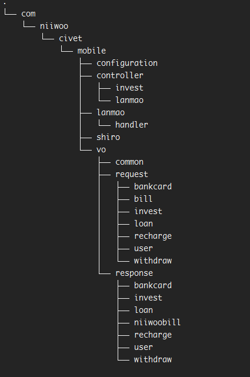

= 架构组开发规范&约定

== 目的
* 统一标准、统一风格

== 工程整体结构

==== 项目结构主要由三大部分构成：基础组件、基础环境、业务开发项目。
===== 基础组件gitlab仓库地址：http://192.168.18.14:81/platform-architecture/niiwoo-tripod.git

* 1、基础组件包含了第三方服务调用以及支持业务快速开发的web层基础库，service层基础库等。业务开发项目直接maven依赖这些组件库Autowired注入相关类即可使用相关功能。
* 2、基础环境为业务项目依赖软件环境，使用到的技术栈。
* 3、web接入层、dubbo服务层、DB属于业务开发需要关心的模块，以下针对这些模块做详细说明
* 4、	整个组件库与业务开发项目主要使用spring-boot技术栈。[red]`不使用传统xml配置bean，使用java config方式配置spring bean。可变配置项集中到application.yml中配置，方便开发运维的维护管理。`

== web接入层
* 1、职责：定义HTTP请求接口，请求报文，响应报文，做请求必填项与安全性校验，调用内部服务，聚合组装服务结果响应给客户端。
* 2、包结构：
以civet-mobile为例，com.niiwoo.civet.mobile为该模块顶级目录，其下按职能分不同子包。如controller、vo等。各个职能包下可按业务功能不同再分子包，如controller.invest、controller.user等。方便做切面配置时基于职能织入切面。[red]`web层的与前端交互的数据模型称之为vo(view object)，放置在vo包下。`

* 3、基础类：为统一规范公共数据模型，在tripod-web中定义了部分客户端请求响应公共数据模型
[source,java,indent=0]
com.niiwoo.tripod.web.vo.Empty：仅返回respCode，message。无业务数据，一般用户增删改请求时。
com.niiwoo.tripod.web.vo.Result<T>：带有业务数据返回的统一数据模型，泛型T为具体业务数据。
com.niiwoo.tripod.web.vo.Page<T>：分页响应数据模型，规范统一分页数据。
T为分页明细中具体业务数据模型。
com.niiwoo.tripod.web.vo.PageRequestVO：分页请求数据模型，统一pageNumber，pageSize参数，具体业务场景按需继承该类，填充分页查询其他参数。
* 4、认证、授权: 项目使用shiro做认证授权处理，通用逻辑集成在tripod-web组件中，业务项目依赖该组件并实现com.niiwoo.tripod.web.shiro.UserDetailService接口查询用户身份，权限信息即可。controller中定义的接口默认需要认证(登录)后才能访问，如需未认证访问，在controller类或者方法上加@AuthIgnore来忽略认证。认证后的访问业务代码可以获取到shiro中维护的用户身份信息
[source,java]
UserAuthPrincipal principal = (UserAuthPrincipal) SecurityUtils.getSubject().getPrincipal();