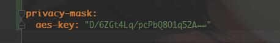

= 基础组件使用

== 公共类库使用
==== 1、敏感数据加密/解密/打码，AES128位加密/解密，秘钥可配置，不配置则使用默认秘钥
[source,java]
com.niiwoo.tripod.base.component.PrivacyMasks: @Autowired注入实例使用

密钥配置：在application.yml中配置

==== 2、身份证工具类：包含身份证号校验、计算年龄、生日等功能(目前由李健同学维护)

[source,java]
com.niiwoo.tripod.base.utils.IdCardUtils: 静态方法直接调用

==== 3、懒猫requestNo,batchNo生成辅助类：该类会区分环境注入不同实例，开发环境会在requestNo中加入额外信息，以便懒猫异步通知分发到各个开发人员机器
[source,java]
com.niiwoo.tripod.lanmao.component.LanMaoSequence: @Autowired注入实例使用

